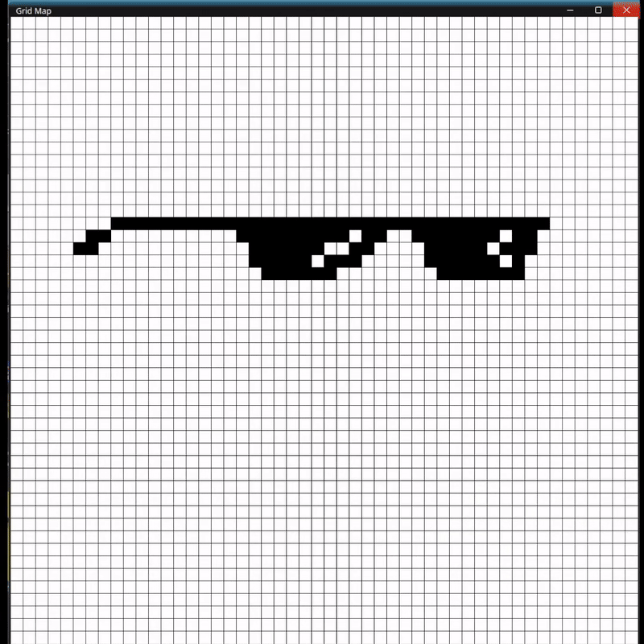

# Grid Pathfinding Visualizer


## Overview

The Grid Pathfinding Visualizer is a powerful and flexible tool designed to visualize various grid-based pathfinding algorithms. It is an educational and research-focused project aimed at helping users understand how different algorithms work and how they can be applied to solve pathfinding problems.

### Working example: Dijkstra and A* algorithms.


## Features

- **Map creation tool**: Before running create the map using your cursor.
- **Support for Multiple Algorithms**: Visualize popular pathfinding algorithms such as A*, Dijkstra, BFS, and DFS.
- **Interactive Grid**: Create, edit, and manipulate grid layouts with obstacles, start, and end points.
- **Step-by-Step Visualization**: Watch algorithms in action step by step, highlighting the decision-making process.
- **Performance Metrics**: View performance metrics like time complexity, space complexity, and number of nodes expanded.
- **Customizable Settings**: Adjust algorithm parameters and grid properties to see how they affect the outcome.

## Installation

To get started with the Pathfinding Visualization Framework, follow these steps:

1. **Clone the Repository**:
    ```bash
    git clone https://github.com/perchess/pathfinding-visualization-framework.git
    cd pathfinding-visualization-framework
    ```

2. **Install Dependencies**:
    ```bash
    # For Python-based projects
    pip install -r requirements.txt

    # For Node.js-based projects
    npm install
    ```

3. **Run the Application**:
    ```bash
    # For Python-based projects
    python main.py

    # For Node.js-based projects
    npm start
    ```

## Usage

1. **Launching the Framework**:
    - After installation, run the application to launch the visualization framework.

2. **Creating the Grid**:
    - Use the interactive interface to create a grid layout. Add start and end points, and place obstacles as needed.

3. **Selecting an Algorithm**:
    - Choose a pathfinding algorithm from the list of supported algorithms.

4. **Running the Visualization**:
    - Start the visualization to see the algorithm in action. Use the step-by-step controls to pause, resume, or step through the algorithm's execution.

5. **Analyzing the Results**:
    - Observe the path found by the algorithm, and review performance metrics displayed on the screen.

## Algorithms Supported

- **Dijkstra**: A classic algorithm for finding the shortest paths from a single source node to all other nodes.
- **A\***: A popular and efficient pathfinding algorithm using heuristics to find the shortest path.

## Customization

The framework is designed to be easily extendable. You can add new algorithms or customize existing ones by modifying the relevant files in the `algorithms` directory.

## Contributing

Contributions are welcome! If you'd like to contribute to this project, please follow these steps:

1. **Fork the Repository**:
    - Click the "Fork" button at the top right of this repository page.

2. **Clone Your Fork**:
    ```bash
    git clone https://github.com/yourusername/pathfinding-visualization-framework.git
    cd pathfinding-visualization-framework
    ```

3. **Create a Branch**:
    ```bash
    git checkout -b feature/your-feature-name
    ```

4. **Make Your Changes**:
    - Implement your feature or fix a bug.

5. **Commit Your Changes**:
    ```bash
    git add .
    git commit -m "Add your commit message here"
    ```

6. **Push to Your Fork**:
    ```bash
    git push origin feature/your-feature-name
    ```

7. **Create a Pull Request**:
    - Go to the original repository on GitHub and create a pull request from your fork.

## License

This project is licensed under the MIT License. See the [LICENSE](LICENSE) file for details.


## Contact

For questions, suggestions, or feedback, please open an issue or contact us at [denis.sokolov48@gmail.com].